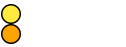

<p  align="center">

</p>

<p  align="center">
<b>A kinetic typography library for ReactJS </b>
</p>

<p  align="center">
<b>0.1.0</b>
</p>

## Usage

```cmd
npm i react-punch
```
```jsx
import { animateText, samples } from "react-punch";
```
```jsx
<b>{animateText("Hello World!",samples.emphasis.bounce(10, "ease-out", 1000, "infinite"),100)}</b>
```
<p  align="center">

</p>

## API

<details><summary>animateClass</summary>

Triggers the animation on mount
```jsx
 <div
        className={animateClass({
          frames:{
            from: { opacity: 0, transform: "scale(0,0)" },
            to: { opacity: 1, transform: "scale(1,1)" },
          },
          easing: "cubic-bezier(0.0, 0.06, 0.05, 0.95)"
        })}
      />
```


Triggers the animation on hover
```jsx
const [hover , setHover] = useState(false);
 <div
       onMouseEnter={() => setHover(true)}
       onMouseLeave={() => setHover(false)}
        className={hover && animateClass({
          frames:{
            from: { opacity: 0, transform: "scale(0,0)" },
            to: { opacity: 1, transform: "scale(1,1)" },
          },
          easing: "cubic-bezier(0.0, 0.06, 0.05, 0.95)"
        })}
      />
```

</p>
</details>

<details><summary>animateElement</summary>

Triggers a succession of animations using a Promise
```jsx
  useEffect(() => {
    const ballA = document.getElementById("ballA");
    const ballB = document.getElementById("ballB");
    animateElement(
      ballA,
      {frames: {to: {transform: "translateX(100px)"}}}
    ).then(() => {
      animateElement(
        ballB,
        { frames: { to: { transform: "translateX(200px)" } } }
      )
    });
  }, []);
 <div id="ballA" />
 <div id="ballB" />
```


Or using simply the duration on the delay property
```jsx
  useEffect(() => {
    const ballA = document.getElementById("ballA");
    const ballB = document.getElementById("ballB");
    animateElement(
      ballA,
      {frames: {to: {transform: "translateX(100px)"}}, duration: 1000}
    );
     animateElement(
      ballB,
      {frames: {to: {transform: "translateX(200px)"}}, delay: 1000}
    )
  }, []);
 <div id="ballA" />
 <div id="ballB" />
```

</details>

<details><summary>animateText</summary>

Triggers an animation on each letter of the text
```jsx
<b>{animateText("Hello World!", samples.emphasis.rubber(), 500)}</b>
```


Or on the whole word
```jsx
<b>{animateText("Hello World!", samples.emphasis.rubber(), 0)}</b>
```

</details>

<details><summary>AnimationGroup</summary>

A component that toggles an animation on its children according to the show property
```jsx
const [show , setShow] = useState(false);
<button onClick={() => setShow(!show)}>Toggle</button>
<AnimationGroup timeout={0} show={show}><div /></AnimationGroup>
```

</details>

## Samples
### Entrance

<details><summary>Fade</summary>

```jsx
<b>{animateText("Hello World!",samples.entrance.fade())}</b>
```

</p>
</details>

<details><summary>Flyin</summary>

```jsx
<b>{animateText("Hello World!",samples.entrance.flyin())}</b>
```

</p>
</details>

<details><summary>Split</summary>

```jsx
<b>{animateText("Hello World!",samples.entrance.split())}</b>
```

</p>
</details>

<details><summary>Wipe</summary>

```jsx
<b>{animateText("Hello World!",samples.entrance.wipe())}</b>
```

</p>
</details>

<details><summary>Shape</summary>

```jsx
<b>{animateText("Hello World!",samples.entrance.shape())}</b>
```

</p>
</details>

<details><summary>Zoom</summary>

```jsx
<b>{animateText("Hello World!",samples.entrance.zoom())}</b>
```

</p>
</details>

<details><summary>Flip</summary>

```jsx
<b>{animateText("Hello World!",samples.entrance.flip())}</b>
```

</p>
</details>

<details><summary>Slide</summary>

```jsx
<b>{animateText("Hello World!",samples.entrance.slide())}</b>
```

</p>
</details>

### Exit

<details><summary>Fade</summary>

```jsx
<b>{animateText("Hello World!",samplesexit.fade())}</b>
```

</p>
</details>

<details><summary>Flyin</summary>

```jsx
<b>{animateText("Hello World!",samplesexit.flyin())}</b>
```

</p>
</details>

<details><summary>Split</summary>

```jsx
<b>{animateText("Hello World!",samplesexit.split())}</b>
```

</p>
</details>

<details><summary>Wipe</summary>

```jsx
<b>{animateText("Hello World!",samplesexit.wipe())}</b>
```

</p>
</details>

<details><summary>Shape</summary>

```jsx
<b>{animateText("Hello World!",samplesexit.shape())}</b>
```

</p>
</details>

<details><summary>Zoom</summary>

```jsx
<b>{animateText("Hello World!",samplesexit.zoom())}</b>
```

</p>
</details>

<details><summary>Flip</summary>

```jsx
<b>{animateText("Hello World!",samplesexit.flip())}</b>
```

</p>
</details>

<details><summary>Slide</summary>

```jsx
<b>{animateText("Hello World!",samplesexit.slide())}</b>
```

</p>
</details>

### Text

<details><summary>Rainbow</summary>

```jsx
<b>{animateText("Hello World!",samples.text.rainbow())}</b>
```

</p>
</details>

<details><summary>Gradient</summary>

```jsx
<b>{animateText("Hello World!",samples.text.gradient())}</b>
```

</p>
</details>

### Other

<details><summary>Draw border</summary>

```jsx
<b>{animateText("Hello World!",samples.other.drawborder())}</b>
```

</p>
</details>

