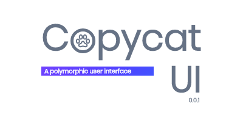

<p  align="center">

</p>

<p align="center">
  <a href="https://solidsnail.github.io/copycat-ui/"></a>
  </p>


# About:
Copycat UI is the first react UI library to be fully built on top of hooks, the latest react team proposal. It comes with a set of usefull tools that make interface building a lot more fun & easy. 
Not only does it provide a set of components, but also a global state management system that is so simple to understand and use but also efficient.
And on top of that, Copycat UI comes with a theming system that allows its users to freely adjust the style of their projects, or even change the theme while running their apps.
# Sneak peek:
```jsx
import React from "react";
import ReactDOM from "react-dom";
import { UI, STATE, themes } from "copycat-ui";
const state = {
 count: 0,
}
function App(){
  return(
    <UI.Core state={state} theme={themes.standard}>
       <UI.Button label="-" onClick={STATE.update("count", v => v - 1)} />
       {STATE.useGet("count")}
       <UI.Button label="+" onClick={STATE.update("count", v => v + 1)} />
    </UI.Core>
  )
}
ReactDOM.render(<App />, ...);
```
<p  align="center">

</p>

# Is it ready for production use ?: 
The work is still in progress therefore the library is for testing purposes only.
# Progress:
<p  align="center">
⬛⬛⬛⬛⬛⬛⬜⬜⬜⬜
<p>
  
# How to install ?

`yarn add copycat-ui` or `npm install copycat-ui`.

# Peer dependencies:
The following packages are peer-dependencies in which Copycat UI rely on, they need to be installed first before you can add copycat-ui to your project:


| Dependency        | Version        
| ------------- |:-------------:| 
| react      | @next |
| react-dom      | @next |
| emotion      | *      |  
| polished | *      |   

# License (MIT)

Copyright (c) 2019 Rachid Daoudi

Permission is hereby granted, free of charge, to any person obtaining a copy
of this software and associated documentation files (the "Software"), to deal
in the Software without restriction, including without limitation the rights
to use, copy, modify, merge, publish, distribute, sublicense, and/or sell
copies of the Software, and to permit persons to whom the Software is
furnished to do so, subject to the following conditions:

The above copyright notice and this permission notice shall be included in all
copies or substantial portions of the Software.

THE SOFTWARE IS PROVIDED "AS IS", WITHOUT WARRANTY OF ANY KIND, EXPRESS OR
IMPLIED, INCLUDING BUT NOT LIMITED TO THE WARRANTIES OF MERCHANTABILITY,
FITNESS FOR A PARTICULAR PURPOSE AND NONINFRINGEMENT. IN NO EVENT SHALL THE
AUTHORS OR COPYRIGHT HOLDERS BE LIABLE FOR ANY CLAIM, DAMAGES OR OTHER
LIABILITY, WHETHER IN AN ACTION OF CONTRACT, TORT OR OTHERWISE, ARISING FROM,
OUT OF OR IN CONNECTION WITH THE SOFTWARE OR THE USE OR OTHER DEALINGS IN THE
SOFTWARE.


<p align="center">
 
  </p>