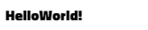
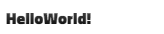

<p  align="center">

</p>

<p  align="center">
<b>A kinetic typography library for ReactJS </b>
</p>

<p  align="center">
<b>0.0.3c</b>
</p>

## Usage

```cmd
npm i react-punch
```
```jsx
import { animateText, samples } from "react-punch";
```
```jsx
<b>{animateText("Hello World!",samples.emphasis.bounce(10, "ease-out", 1000, "infinite"),100)}</b>
```
<p  align="center">

</p>

## API

<details><summary>animateClass</summary>

Triggers the animation on mount
```jsx
 <div
        className={animateClass({
          frames:{
            from: { opacity: 0, transform: "scale(0,0)" },
            to: { opacity: 1, transform: "scale(1,1)" },
          },
          easing: "cubic-bezier(0.0, 0.06, 0.05, 0.95)"
        })}
      />
```

</p>
</details>

## Samples
### Entrance

<details><summary>Fade</summary>

```jsx
<b>{animateText("Hello World!",samples.entrance.fade())}</b>
```

</p>
</details>

<details><summary>Flyin</summary>

```jsx
<b>{animateText("Hello World!",samples.entrance.flyin())}</b>
```

</p>
</details>

<details><summary>Split</summary>

```jsx
<b>{animateText("Hello World!",samples.entrance.split())}</b>
```

</p>
</details>

<details><summary>Wipe</summary>

```jsx
<b>{animateText("Hello World!",samples.entrance.wipe())}</b>
```

</p>
</details>

<details><summary>Shape</summary>

```jsx
<b>{animateText("Hello World!",samples.entrance.shape())}</b>
```

</p>
</details>

<details><summary>Zoom</summary>

```jsx
<b>{animateText("Hello World!",samples.entrance.zoom())}</b>
```

</p>
</details>

<details><summary>Flip</summary>

```jsx
<b>{animateText("Hello World!",samples.entrance.flip())}</b>
```

</p>
</details>

<details><summary>Slide</summary>

```jsx
<b>{animateText("Hello World!",samples.entrance.slide())}</b>
```

</p>
</details>

### Exit

<details><summary>Fade</summary>

```jsx
<b>{animateText("Hello World!",samplesexit.fade())}</b>
```

</p>
</details>

<details><summary>Flyin</summary>

```jsx
<b>{animateText("Hello World!",samplesexit.flyin())}</b>
```

</p>
</details>

<details><summary>Split</summary>

```jsx
<b>{animateText("Hello World!",samplesexit.split())}</b>
```

</p>
</details>

<details><summary>Wipe</summary>

```jsx
<b>{animateText("Hello World!",samplesexit.wipe())}</b>
```

</p>
</details>

<details><summary>Shape</summary>

```jsx
<b>{animateText("Hello World!",samplesexit.shape())}</b>
```

</p>
</details>

<details><summary>Zoom</summary>

```jsx
<b>{animateText("Hello World!",samplesexit.zoom())}</b>
```

</p>
</details>

<details><summary>Flip</summary>

```jsx
<b>{animateText("Hello World!",samplesexit.flip())}</b>
```

</p>
</details>

<details><summary>Slide</summary>

```jsx
<b>{animateText("Hello World!",samplesexit.slide())}</b>
```

</p>
</details>

### Text

<details><summary>Rainbow</summary>

```jsx
<b>{animateText("Hello World!",samples.text.rainbow())}</b>
```

</p>
</details>

<details><summary>Gradient</summary>

```jsx
<b>{animateText("Hello World!",samples.text.gradient())}</b>
```

</p>
</details>
